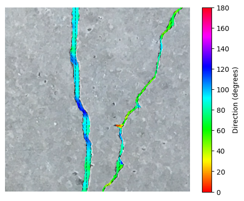

# Dense Direction

### Description
The `dense_direction` is a framework for dense direction estimation of linear objects in images.
It is built on top of popular OpenMMLab's libraries (`mmengine`, `mmcv`, and `mmseg`), and utilizes loss-based 
algorithmic weak-supervision to learn the direction estimation of linear objects from semantic segmentation maps.

### Key Features
- **Loss-Based Weak-Supervision**: My approach leverages loss functions to guide the learning process, reducing the need for explicit labeling. There is no need for direction labels, only widely available semantic segmentation maps are needed.
- **Integration with Semantic Segmentation**: The framework seamlessly integrates with semantic segmentation techniques, providing the means to train it alongside direction estimation.
- **Extension of OpenMMLab's frameworks**: By building upon MMSegmentation, we can tap into its established library and expertise in semantic segmentation.

### What is dense direction estimation?

It is a dense task that estimates the local direction for every pixel belonging to a linear structure (e.g., cracks, roads, fibers, vessels). Unlike edge detection or segmentation alone, it provides a continuous direction field that describes “which way the structure runs” at each location.

#### Example output:

The plot shows a colored overlay that encodes the estimated per‑pixel direction for pixels classified as `concrete crack`.

  

#### Angle convention and range:
- Directions are estimated in the range [0, π), i.e., direction is modulo 180° (0° and 180° represent the same direction along a line).
- Angles increase counter‑clockwise from the image x‑axis (horizontal to the right).
- This convention is common for undirected linear structures; it avoids ambiguity between opposite directions along the same line.

#### Why this is useful:
- Enables downstream tasks that need local direction, such as topology analysis, path following, and measuring directional consistency or curvature along linear objects.
- Complements semantic segmentation by adding geometric context (direction) without requiring explicit direction labels.
