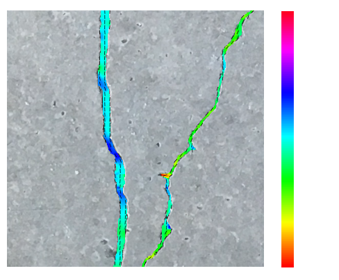
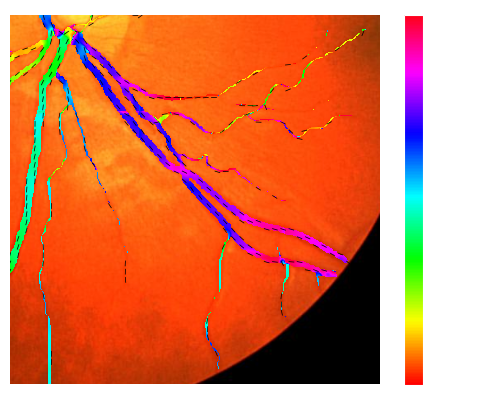
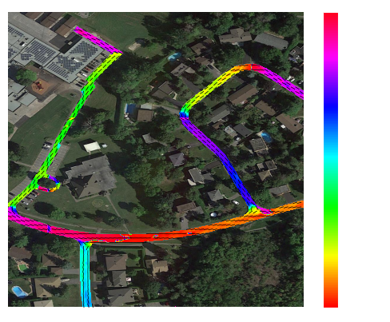

# Dense Direction
**Dense per-pixel direction estimation for linear structures (cracks, vessels, roads, fibers, …) trained with 
weak supervision from segmentation masks only — no direction labels needed.**

Dense Direction is a framework for dense direction estimation of linear objects in images. It is built on
OpenMMLab (`mmengine`, `mmcv`, `mmseg`) and uses loss-based weak supervision to learn direction fields from
semantic segmentation maps, without requiring explicit direction labels.

## Table of contents
- [Key features](#key-features)
- [What is dense direction estimation?](#what-is-dense-direction-estimation)
- [Directional loss (overview)](#directional-loss-overview)
- [Getting started](#getting-started)
- [Configuration](#configuration)
- [File structure](#file-structure)
- [Core package layout](#core-package-layout)

## Key features
- **Loss-based weak supervision**: Learn a direction without direction annotations by supervising with losses.
- **Segmentation-aligned training**: Train alongside semantic segmentation models and reuse their signals.
- **OpenMMLab-native**: Extends `mmseg` conventions for configs, runners, and training loops.

## What is dense direction estimation?
Dense direction estimation assigns a local direction to every pixel belonging to a linear structure
(e.g., cracks, roads, fibers, vessels). Unlike edge detection or segmentation alone, it yields a continuous
direction field describing the tangent of the structure at each location.

### Example output
The plots show a colored overlay that encodes the estimated per-pixel direction for pixels classified as
`concrete crack`, `blood vessel`, and `road` in the example images from the `Concrete-Cracks`, `CHASE-DB1`,
and `Ottawa-Roads` datasets.

<p align="center">
  
  
  
</p>

### Angle convention and range
- Directions are estimated in the range [0, π), i.e., the direction is modulo 180 degrees.
- Angles increase counter-clockwise from the image x-axis (horizontal to the right).
- This convention avoids ambiguity between opposite directions along the same line.

### Why this is useful
- Enables downstream tasks that need local direction, such as topology analysis, path following, and
  measuring directional consistency or curvature along linear objects.
- Complements semantic segmentation by adding geometric context without extra direction labels.

## Directional loss (overview)
Directional loss compares a predicted per-pixel direction against direction cues derived from the
segmentation mask. The loss first converts the predicted 2D vector field into angles (modulo 180
degrees), then builds a distribution of directional evidence from local mask patches using kernel
responses. The final loss weights each predicted angle by these kernel-based direction values and
reduces across pixels.

### EfficientDirectionalLoss
`EfficientDirectionalLoss` implements the same objective with a reduced memory footprint by
vectorizing patch extraction and kernel projection. Use it when training on large images, large
batch sizes, or when GPU memory is tight; it matches the standard loss behavior while
requiring less memory in standard use cases (there are situations where the efficient loss is 
not efficient, but it's unlikely in practice).

## Getting started
1) Install the OpenMMLab stack (`mmengine`, `mmcv`, `mmseg`) following their official documentation.
2) Install the remaining Python dependencies:
   ```bash
   pip install -r requirements.txt
   ```
3) Pick a config and run training/testing:
   ```bash
   python run.py --config configs/dir/dinov2_dpt_concrete_cracks_10k.py
   ```
For more detail, see [SETUP.md](docs/SETUP.md) and [USAGE.md](docs/USAGE.md).

## Configuration
Configs live under `configs/` and follow standard OpenMMLab style. The main folders are:
- `configs/dir`: direction-only training.
- `configs/seg_dir`: joint segmentation + direction variants.

## File structure
```
.
├─ configs/               OpenMMLab configs and experiment variants
│  ├─ _base_/             Base config fragments
│  ├─ dir/                Direction-only configs
│  └─ seg_dir/            Segmentation + direction configs
├─ data/                  Datasets
├─ dense_direction/       Core package (expanded below)
├─ docs/                  Documentation assets
├─ outputs/               Training outputs/checkpoints
├─ tools/                 Dataset scripts/utilities
├─ run.py                 Training/testing entry point
└─ requirements.txt       Minimal Python dependencies
```
#### Notes
- `data/` and `outputs/` are intentionally untracked; point configs at your local paths.
- For details on runners, hooks, and config syntax, see the `mmengine`/`mmseg` docs.

### Core package layout
```
dense_direction/                     Dense direction framework.
├─ data/                             Datasets and transforms.
│  ├─ datasets/                      Dataset definitions.
│  │  ├─ concrete_cracks.py          ConcreteCracks dataset.
│  │  └─ ottawa_roads.py             OttawaRoads dataset.
│  └─ transforms/                    Data transforms.
│     ├─ binarize_annotations.py     BinarizeAnnotations.
│     ├─ centerline_dirs.py          CenterlineToDirections.
│     ├─ custom_packer.py            PackCustomInputs.
│     └─ mask_guided_crop.py         Mask-guided crop.
├─ evaluation/                       Evaluation and metrics.
│  └─ metrics/                       Metric implementations.
│     ├─ centerline_direction.py     CenterlineDirectionMetric.
│     ├─ directional_loss.py         DirectionalLossMetric.
│     └─ dump_samples.py             DumpSamples.
├─ modeling/                         Model components.
│  ├─ backbones/                     Backbone wrappers.
│  │  ├─ dino2_hub.py                DINOv2 hub wrapper.
│  │  └─ dino3_hub.py                DINOv3 hub wrapper.
│  ├─ blocks/                        Building blocks.
│  │  └─ dpt_decoder.py              DPT decoder.
│  ├─ heads/                         Decode heads.
│  │  ├─ base_direction.py           BaseDirection head.
│  │  ├─ dpt_direction.py            DPT direction head.
│  │  ├─ dual_head.py                Dual head.
│  │  ├─ dummy_direction.py          DummyDirection head.
│  │  ├─ linear_direction.py         LinearDirection head.
│  │  ├─ linear_segmentation.py      LinearSegmentation head.
│  │  └─ multiscale_direction.py     MultiscaleDirection head.
│  ├─ losses/                        Losses and kernels.
│  │  ├─ directional.py              Directional loss.
│  │  ├─ efficient_directional.py    Efficient directional loss.
│  │  ├─ smoothness.py               Smoothness loss.
│  │  └─ kernels/                    Loss kernels.
│  │     ├─ directional_kernels.py   Directional kernels.
│  │     └─ utils.py                 Kernel utilities.
│  └─ meta_arch/                     Meta-architectures.
│     ├─ directioner.py              Directioner.
│     └─ segmento_directioner.py     SegmentoDirectioner.
└─ visualization/                    Visualizers.
   └─ seg_dir_visualizer.py          Seg+dir visualizer.
```
